<h1 align="center">Savoir</h1>

  

    A restaurant reservation app that allows users to book tables at their favorite restaurants effortlessly.

## Features

- Email / Password Authentication 📲: Users can sign up and log in to the app using their email and password.
- Google Maps Integration 🗺️: Users can view the location of their near restaurants on Google Maps.
- Restaurant Search 🍽️: Users can search for their favorite restaurants by name.
- Restaurant Details 📝: Users can view the details of a restaurant including its location, menu, and reviews.
- Table Reservation 📅: Users can book a table at a restaurant for a specific date and time.
- User Profile 🧑: Users can view and edit their profile information.
- Favorites 🌟: Users can add restaurants to their favorites list.
- Reviews 📝: Users can leave reviews for restaurants they have visited.
- Filter 🧐: Users can filter restaurants by cuisine.
- Reservation History 📅: Users can view their reservation history.
- Statistics 📊: Users can view statistics about their reservations.

## Screenshots

Here are some screenshots of the app.
| Onboarding (1) | Onboarding (2) | Onboarding (3) |
| :------------------------------------------: | :-------------------------------------------------: | :-----------------------------------------------: |
| 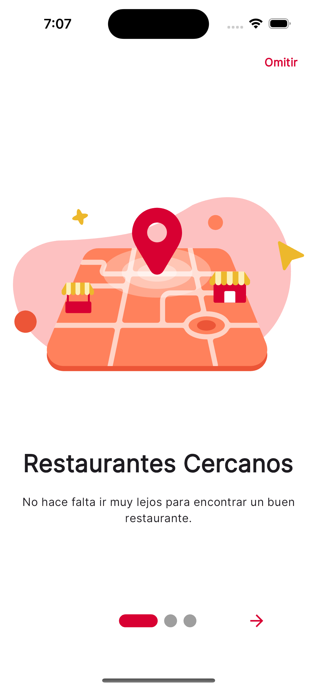 | 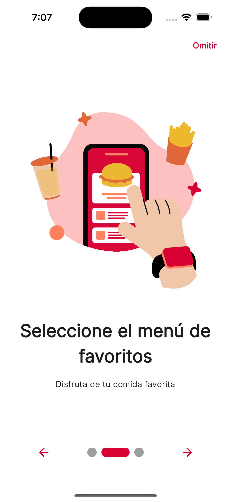 | 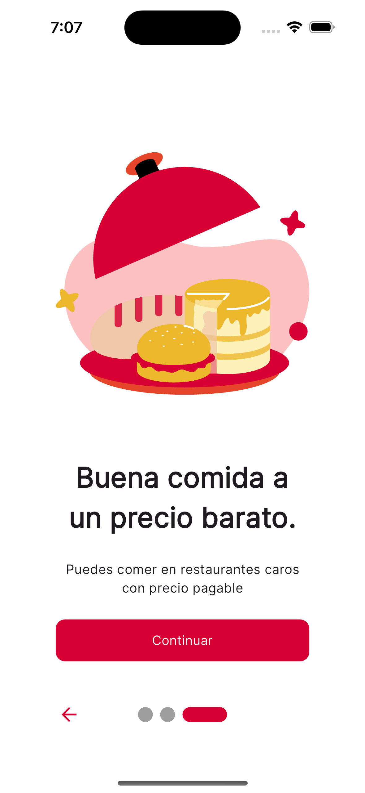 |

|                      Welcome                      |                     Login                     |                      Profile                      |
| :-----------------------------------------------: | :-------------------------------------------: | :-----------------------------------------------: |
| 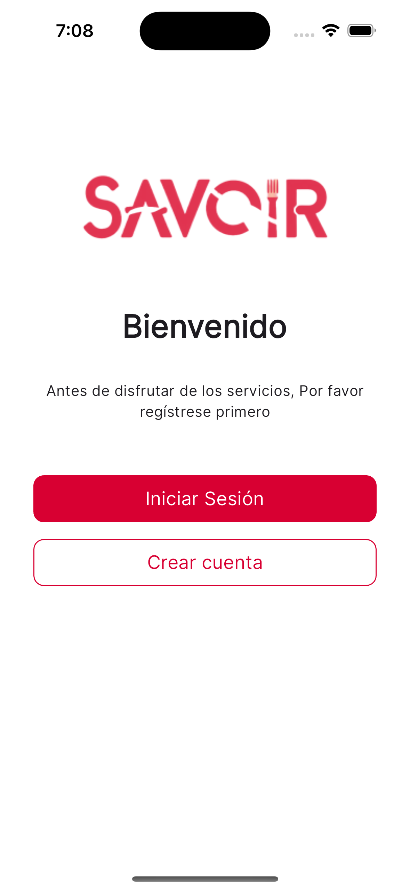 | 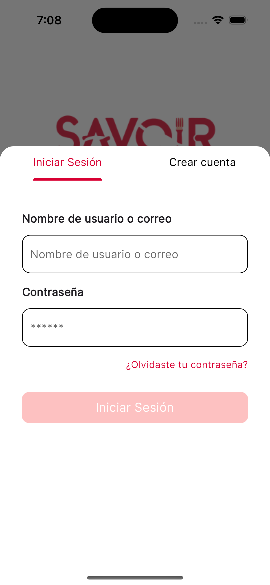 | 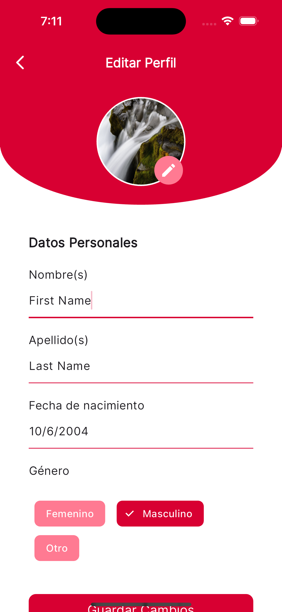 |

|                     Search                      |                     Map                     |                       Favorites                        |
| :---------------------------------------------: | :-----------------------------------------: | :----------------------------------------------------: |
| 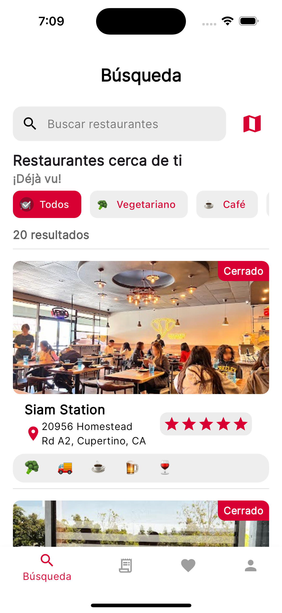 | 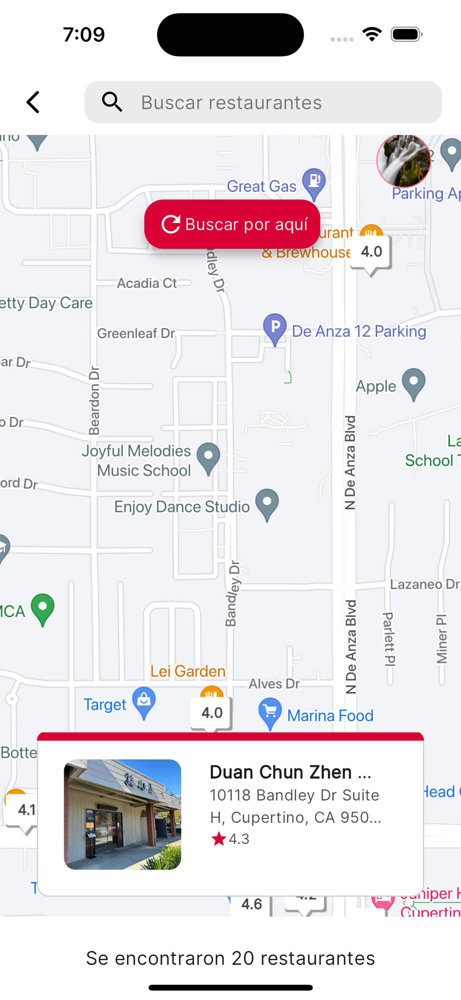 | 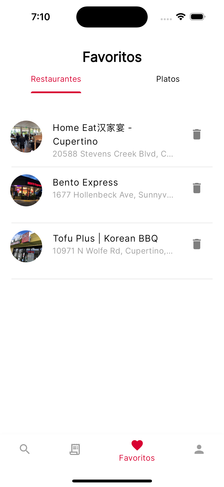 |

|                          Info                          |                      Reviews                      |                         Reservations                          |
| :----------------------------------------------------: | :-----------------------------------------------: | :-----------------------------------------------------------: |
| 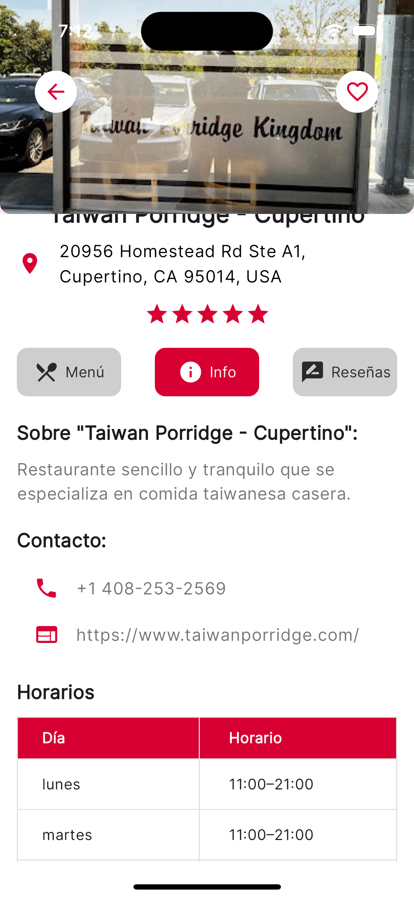 | 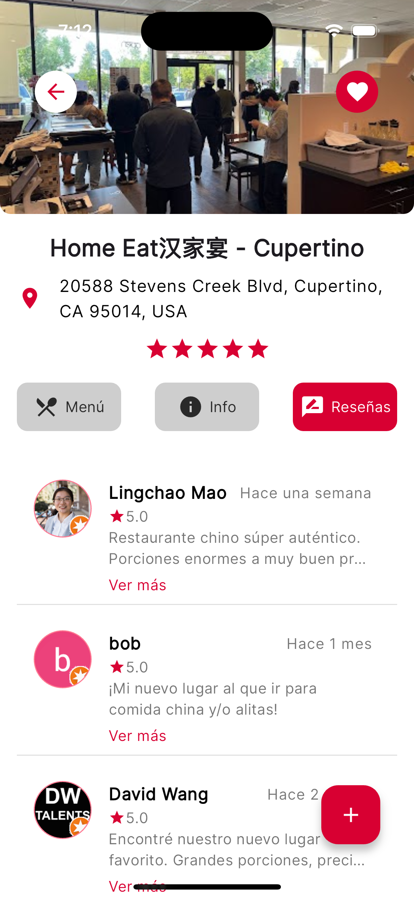 | 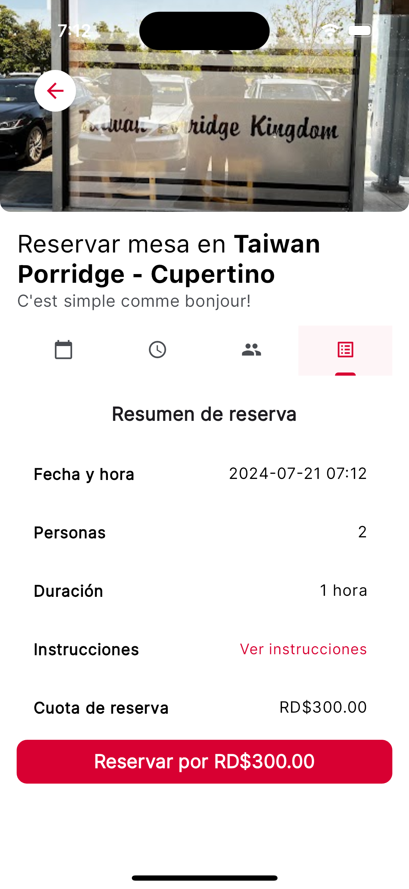 |

|                        Reservations                         |                        Reservation Details                        |                      Settings                       |
| :---------------------------------------------------------: | :---------------------------------------------------------------: | :-------------------------------------------------: |
| 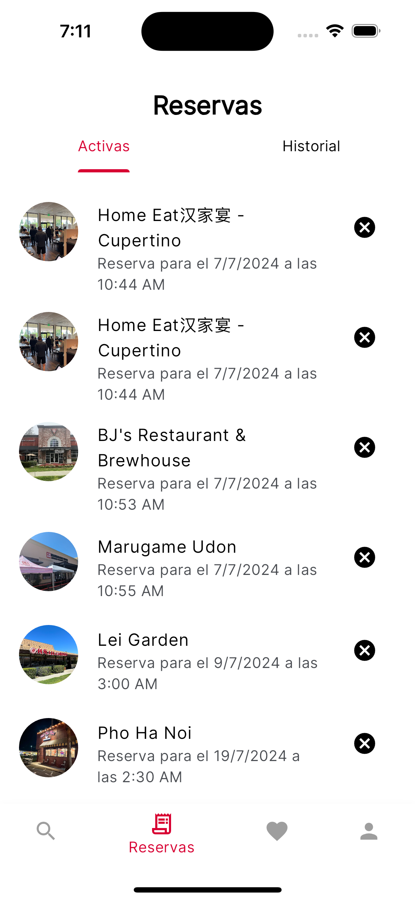 | 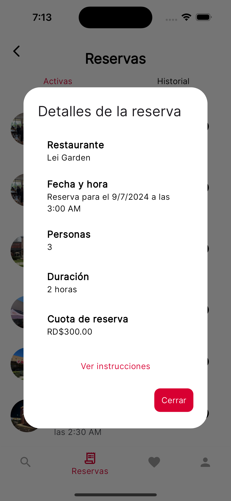 | 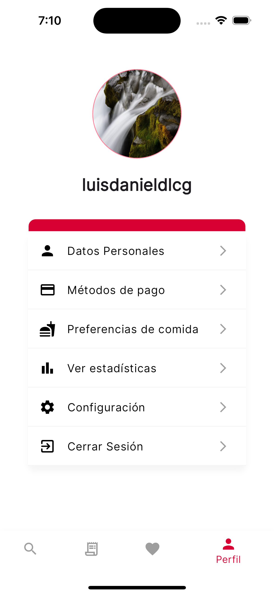 |
|                         Statistics                          |
|       :---------------------------------------------:       |
|       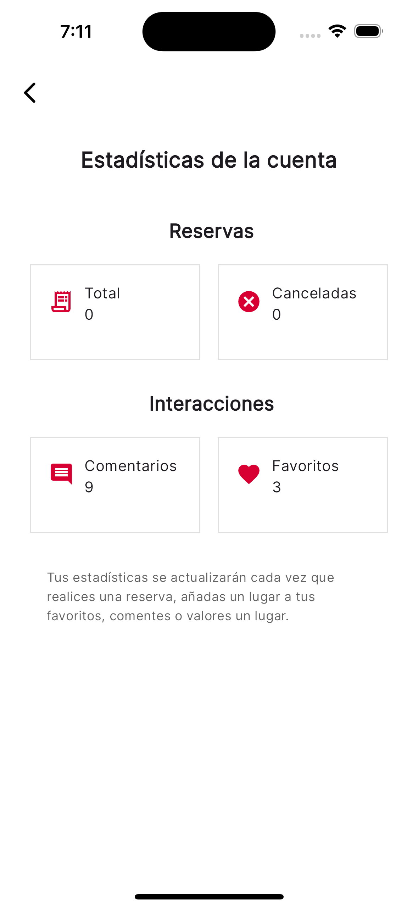        |

## Getting Started

To get started and run the app, you first need to create firebase project to set the required environment variables.

- Create a `.env` file in the root of the project.
- Copy the content of `.env.example` to `.env` and fill the required fields.

I recommend using both firebase and flutterfire CLI tools to configure firebase: https://firebase.google.com/docs/flutter/setup

After running `flutterfire configure`, a generated file `firebase_options.dart` will be created in the `lib` folder.
This file will contain the required environment variables from your firebase project for the app to work.

Once everything is set up, you can `flutter run` the app. If you don't get any exception while loading the app, you are good to go.
